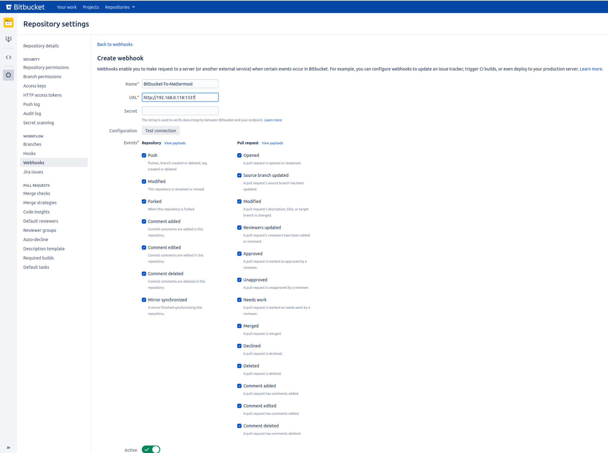

# Bitbucket to Mattermost Notifier
This application serves as a proxy for event payloads (https://confluence.atlassian.com/bitbucketserver/event-payload-938025882.html) coming from Bitbucket, formats them, and sends them as useful messages to Mattermost.

## Configuration
The application can be configured using either environment variables or a `config.env` file. The following parameters can be configured:

`LISTEN_PORT`: The port on which the application will listen for incoming webhooks from Bitbucket (default: 1337)
`MATTERMOST_WEBHOOKURL`: The URL of the incoming webhook for your Mattermost channel
`MATTERMOST_USERNAME`: The username that will be displayed as the sender of the message in Mattermost (default: Bitbucket)
`MATTERMOST_CHANNEL`: The Mattermost channel to which the messages will be sent (default: town-square)
`MESSAGE_ICON_EMOJI`: The emoji that will be used as the icon for the messages (default: :exclamation:)
`INFO_COLOR`: The color code to be used for info messages (default: 3498db)
`DECLINED_COLOR`: The color code to be used for declined messages (default: e74c3c)
`WARNING_COLOR`: The color code to be used for warning messages (default: f1c40f)
`SUCCESS_COLOR`: The color code to be used for success messages (default: 2ecc71)

When using `environment variables`, you need to add `BMN_` before each variable (e.g. BMN_LISTEN_PORT, BMN_MATTERMOST_WEBHOOKURL, BMN_MATTERMOST_USERNAME, ...).
The application will automatically use the environment variables if present, otherwise it will use the values from the config.env file.

### Bitbucket configuration
Create a new webhook within your repository you want to receive messages to Mattermost.

## Running the Application
### Go Executable
1. Download the latest release of the application from the releases page
2. Create a `config.env` file with the parameters above (or rename and editing the config.env.sample file)in the root of the executable or set the environment variables
3. Run the application with `./bitbucket-to-mattermost-notifier`

### Docker Image
1. Pull the latest version of the image from Docker Hub by running `docker pull docker.io/danielschroeter/bitbucket-mattermost-notifier:latest` or pull the image from Github with `docker pull ghcr.io/danielchristianschroeter/bitbucket-mattermost-notifier:latest`
2. Run the container as follows: `docker run -p 1337:1337 -e BMN_MATTERMOST_WEBHOOKURL=<webhook_url> -e BMN_MATTERMOST_USERNAME=<username> -e BMN_MATTERMOST_CHANNEL=<channel> bitbucket-mattermost-notifier`

Make sure to replace `<webhook_url>`, `<username>`, `<channel>` with your Mattermost webhook URL, username, and channel respectively. The environment variables should also include all other necessary configuration options as described above.

## Usage
Once the application is running, configure the webhook URL in your Bitbucket repository settings to point to the URL of your server where the application is hosted. The application will listen for incoming webhooks and format the payload into a message to be sent to the configured Mattermost channel.

The application will also change the color of the message depending on the event type.

You can also test the application by sending a payload to the listen url with the payload examples in the eventpayload/datacenter/example_payload directory.

## Note
The application is designed to work with Bitbucket webhooks, it may not work with other webhooks.

## Support
If you have any issues or questions, please open an issue or discussion on the GitHub repository.